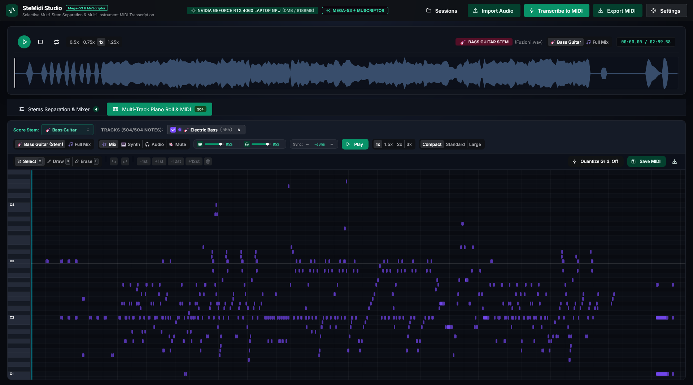

# 🎵 SteMidi Studio

<div align="center">

**High-Performance AI Audio Stem Separation & Multi-Instrument MIDI Transcription Suite**

[](#)
[](https://pytorch.org/)
[](https://developer.nvidia.com/cuda-toolkit)
[](https://fastapi.tiangolo.com/)
[](https://react.dev/)
[](https://mantine.dev/)
[](LICENSE)

*Isolate any of 53 individual instrument stems with BS-RoFormer Mega and transcribe them into clean, quantized Type 1 Multi-Track MIDI using MuScriptor Large (1.3B) & Medium (350M).*

[Key Features](#-key-features) •
[Architecture](docs/architecture.md) •
[Installation Guide](docs/installation.md) •
[Model Zoo](docs/models.md) •
[User Guide](docs/user-guide.md) •
[API Reference](docs/api-reference.md) •
[Troubleshooting](docs/troubleshooting.md)

<br/>



</div>

---

## 🌟 Key Features

- **53-Stem Dedicated Source Separation**:
  - Powered by **BS-RoFormer MVSep Mega-53-stems** (`v1`).
  - Dedicated neural checkpoints for 53 distinct instruments (vocals, guitars, bass, drums, strings, brass, woodwinds, synths, and percussions).
  - Hann-window Constant Overlap-Add (COLA) chunking with 87.5% overlap (8x Hann OLA) for zero boundary artifacts.
  - Automatic VRAM caching and garbage collection.

- **Polyphonic Multi-Instrument Automatic Music Transcription (AMT)**:
  - Powered by **MuScriptor Large (1.3B)** and **Medium (350M)** transformers.
  - Native **BF16 / FP16 PyTorch CUDA** execution with near-instant transcription (~2–4 seconds on RTX 4060).
  - 35+ instrument conditioning constraints (constrain transcription to piano, guitar, bass, vocal, strings, drums, etc. to eliminate phantom notes).
  - Audio-time synchronized note onsets, offsets, and velocity dynamics.

- **Zero-GPU Audio Monitoring & Web DAW**:
  - Audio playback and waveform scrubbing run entirely via browser **Web Audio API** and **WaveSurfer.js**, keeping your GPU 100% idle for AI inference.
  - **Sample-Accurate Synthesizer & Smooth Playhead**: Custom Web Audio lookahead scheduler (180 ms queue, 4 ms attack envelope, dynamics compression) paired with a high-precision 60/144 FPS animation loop for zero-stutter playback.
  - **Real-Time Latency Alignment**: On-the-fly latency compensation (`[-60 ms]` toolbar control) for instant zero-phase sync between audio acoustic transients and MIDI synthesis.
  - Multi-track mixer with individual stem faders, solo, mute, and A/B source comparison.
  - Interactive multi-track Piano Roll editor with note drawing, deletion, pitch transposition, and duration adjustments.

- **Studio-Grade MIDI Post-Processing & Export**:
  - Automatic song tempo detection (BPM) and beat-grid alignment to eliminate irrational tuplets and 64th rests.
  - Chord snapping (32 ms window) and ghost note glitch filtering.
  - Direct export to standard **Type 1 Multi-Track MIDI (`.mid`)** compatible with all major DAWs (Ableton Live, FL Studio, Logic Pro, Reaper, Cubase, Studio One, Sibelius, MuseScore).

---

## 🏛️ System Architecture

SteMidi Studio is built on a clean, decoupled client-server architecture designed for high throughput, low memory footprint, and cross-platform desktop distribution.

```mermaid
graph TD
    subgraph Client ["Client GUI (React 19 + Mantine UI)"]
        UI[Mantine Dark Studio UI]
        WS[WaveSurfer.js Waveform Engine]
        MIX[Web Audio API Multi-Track Mixer]
        ROLL[Interactive Multi-Track Piano Roll]
    end

    subgraph Server ["FastAPI Backend (Port 8000)"]
        API[FastAPI REST & Static File Server]
        SM[Session Manager & Storage]
        PP[MIDI Post-Processor & Quantizer]
    end

    subgraph AI ["AI Neural Inference Engine (PyTorch CUDA)"]
        ROFORMER[BS-RoFormer Mega-53<br/>Band-Split Rotary Transformer]
        MUSCRIPTOR[MuScriptor 1.3B / 350M<br/>48-Layer / 24-Layer Transformer]
    end

    UI -->|HTTP / Audio Upload| API
    API --> SM
    SM -->|WAV Chunks| ROFORMER
    ROFORMER -->|Isolated Stems| SM
    SM -->|Stem Audio| MUSCRIPTOR
    MUSCRIPTOR -->|Note Tokens & Pitch| PP
    PP -->|Type 1 MIDI (.mid)| SM
    SM -->|Peaks & Stems JSON| UI
    UI --> WS
    UI --> MIX
    UI --> ROLL
```

### Technical Component Breakdown

1. **Frontend GUI (`client/`)**:
   - **Framework**: React 19 with Vite bundle tooling.
   - **Design System**: Mantine UI v9 (full dark mode, studio emerald/teal palette, zero button gradients).
   - **Waveform Engine**: WaveSurfer.js v8 with custom WebGL / 2D Canvas fallback and hover timestamps.
   - **Audio Engine**: Custom `webAudioMixer.js` utilizing the Web Audio API (`AudioContext`, `GainNode`, `ChannelMergerNode`) for synchronized multi-track stem playback without GPU compositing overhead.

2. **Backend API (`server/`)**:
   - **Framework**: FastAPI with Uvicorn ASGI server.
   - **Session Manager (`session_manager.py`)**: Persistent workspace management storing audio waveforms, isolated stem WAVs, transcription events, and serialized MIDI files.
   - **Routes (`routes.py`)**: Modular endpoints for audio upload, stem separation, transcription, model status, and multi-format export (MIDI, ZIP, JSON).

3. **Separation Engine (`server/mega_roformer_separator.py`)**:
   - Band-Split Rotary Transformer operating on 44.1 kHz stereo audio.
   - Fast STFT processing (2048 FFT window, 512 hop length) locked to integer boundary multiples.
   - Dynamic VRAM manager purging unused stem checkpoints to stay within an 8 GB VRAM budget.

4. **Transcription Engine (`server/muscriptor_transcriber.py`)**:
   - Unified loader supporting both MuScriptor Large (`1.3B`, 48 layers, 1536 dim) and Medium (`350M`, 24 layers, 1024 dim).
   - Supports instrument conditioning tokens and beat-grid audio alignment.
   - Post-processor (`transcription_postprocess.py`) sanitizing overlapping notes, pitch-quantizing, and formatting standard Type 1 MIDI tracks.

---

## 📦 Model Zoo & Download Guide

To keep the git repository lightweight, neural network model weights are not committed to Git. You must download the model checkpoints before running separation or transcription.

### Required Model Directory Structure

Place weights inside the `models/` directory according to this layout:

```
gh_app/
└── models/
    ├── muscriptor-large/
    │   ├── config.json               # Model config (included in repo)
    │   └── model.safetensors         # 1.3B weights (~5.4 GB)
    ├── muscriptor-medium/
    │   ├── config.json               # Model config (included in repo)
    │   └── model.safetensors         # 350M weights (~1.2 GB)
    └── BS-Roformer-MVSep-Mega-53-stems/
        └── v1/
            ├── bs_mega_53stem_lead-vocal_mvsep.ckpt
            ├── bs_mega_53stem_lead-vocal_mvsep_config.yaml
            ├── bs_mega_53stem_drums_mvsep.ckpt
            ├── bs_mega_53stem_drums_mvsep_config.yaml
            ├── bs_mega_53stem_bass_mvsep.ckpt
            ├── bs_mega_53stem_bass_mvsep_config.yaml
            └── ... (up to 53 stems, ~4.1 GB total)
```

---

### 🔑 Hugging Face Authentication & License Acceptance (Required for MuScriptor)

To use **MuScriptor** models locally, you must first accept their license on Hugging Face and authenticate your local machine:

1. **Accept the License in your Browser**:
   - Log into [Hugging Face](https://huggingface.co).
   - Visit the model page for [MuScriptor Large](https://huggingface.co/MuScriptor/muscriptor-large) (or [Medium](https://huggingface.co/MuScriptor/muscriptor-medium) / [Small](https://huggingface.co/MuScriptor/muscriptor-small)).
   - Accept the **CC BY-NC 4.0** license agreement (*access is granted automatically upon clicking 'Agree'*).

2. **Authenticate on Your Machine**:
   Create a User Access Token with read permissions at [huggingface.co/settings/tokens](https://huggingface.co/settings/tokens), then authenticate using either:

   ```bash
   # Option A: Set an environment variable (recommended)
   export HF_TOKEN=hf_...

   # Option B: Authenticate via CLI
   uvx hf auth login
   # or:
   huggingface-cli login
   ```

*(Note: BS-RoFormer Mega-53 separation checkpoints are in a public repository and do not require license acceptance).*

---

### Option 1: Automated Download Script (Recommended)

A helper script is provided in `scripts/download_models.py` that utilizes `huggingface_hub` to download checkpoints with progress indicators and automatic authentication token detection:

```bash
# Make sure huggingface_hub is installed
pip install huggingface_hub

# 1. Interactive Menu (pick and choose):
python scripts/download_models.py

# 2. Download MuScriptor Large (Recommended flagship AMT model, ~5.4 GB):
python scripts/download_models.py --muscriptor-large

# Or pass token directly on the command line:
python scripts/download_models.py --muscriptor-large --hf-token hf_...

# 3. Download MuScriptor Medium (Fast & lightweight AMT model, ~1.2 GB):
python scripts/download_models.py --muscriptor-medium

# 4. Download All 53 BS-RoFormer Stems (~4.1 GB, public):
python scripts/download_models.py --mega-53

# 5. Download ONLY essential stems to save disk (e.g. vocals, drums, bass, guitar, piano):
python scripts/download_models.py --mega-stems lead-vocal vocal drums bass electric-guitar acoustic-guitar piano

# 6. Download everything at once (~10.7 GB):
python scripts/download_models.py --all
```

---

### Option 2: Hugging Face CLI

You can also use the official `huggingface-cli`:

```bash
# 1. MuScriptor Large (1.3B)
huggingface-cli download MuScriptor/muscriptor-large --local-dir models/muscriptor-large --local-dir-use-symlinks False

# 2. MuScriptor Medium (350M)
huggingface-cli download MuScriptor/muscriptor-medium --local-dir models/muscriptor-medium --local-dir-use-symlinks False

# 3. BS-RoFormer Mega-53 Stems
huggingface-cli download noblebarkrr/BS-Roformer-MVSep-Mega-53-stems --local-dir models/BS-Roformer-MVSep-Mega-53-stems --local-dir-use-symlinks False
```

---

### Option 3: Manual Browser Download

If downloading through a web browser:

1. **MuScriptor Large**: Visit [huggingface.co/MuScriptor/muscriptor-large](https://huggingface.co/MuScriptor/muscriptor-large/tree/main). Download `model.safetensors` and save to `models/muscriptor-large/`.
2. **MuScriptor Medium**: Visit [huggingface.co/MuScriptor/muscriptor-medium](https://huggingface.co/MuScriptor/muscriptor-medium/tree/main). Download `model.safetensors` and save to `models/muscriptor-medium/`.
3. **BS-RoFormer Mega 53-Stems**: Visit [huggingface.co/noblebarkrr/BS-Roformer-MVSep-Mega-53-stems](https://huggingface.co/noblebarkrr/BS-Roformer-MVSep-Mega-53-stems/tree/main/v1). Download desired `.ckpt` and `.yaml` files into `models/BS-Roformer-MVSep-Mega-53-stems/v1/`.

---

## 🚀 Developer Setup & Quickstart

### 1. Prerequisites

- **Operating System**: Linux (Ubuntu 20.04+, Debian, Arch, Fedora) or Windows 10/11.
- **Python**: 3.10, 3.11, or 3.12.
- **FFmpeg**: Required for audio decoding and resampling (`sudo apt install ffmpeg` on Linux, or `winget install Gyan.FFmpeg` on Windows).
- **GPU (Recommended)**: NVIDIA GPU with CUDA 12+ and 6 GB+ VRAM (RTX 3060/4060 or higher). *CPU mode is supported as a fallback.*
- **Node.js (Optional)**: 18.0 or newer. *(Only needed if you want to modify the React frontend; a pre-compiled, optimized bundle is already included in `client/dist/`)*.

---

### 2. Installation Steps

#### Clone the Repository
```bash
git clone https://github.com/your-username/stemidi-studio.git
cd stemidi-studio
```

#### Set Up Python Virtual Environment
```bash
python3 -m venv .venv
source .venv/bin/activate       # On Windows: .venv\Scripts\activate

pip install --upgrade pip
pip install -r requirements.txt
```

> **Note for PyTorch CUDA Support**: Verify that PyTorch detects your NVIDIA GPU:
> ```bash
> python -c "import torch; print('CUDA Available:', torch.cuda.is_available(), '| GPU:', torch.cuda.get_device_name(0) if torch.cuda.is_available() else 'None')"
> ```
> If CUDA is not available, install PyTorch with CUDA 12 from [pytorch.org](https://pytorch.org/get-started/locally/):
> ```bash
> pip install torch torchaudio --index-url https://download.pytorch.org/whl/cu121
> ```

#### Download Models
```bash
python scripts/download_models.py --muscriptor-large --mega-53
```

*(Optional) Rebuilding Frontend Assets (developers only)*:
If you customize components inside `client/src/`, rebuild the client bundle with:
```bash
cd client
npm install
npm run build
cd ..
```

---

### 3. Launching the Studio

Run the unified launcher:
```bash
python run_studio.py
```

The launcher will:
1. Verify the Python virtual environment and activate CUDA libraries.
2. Verify that `client/dist` exists (or build it automatically).
3. Start the FastAPI server on `http://localhost:8000`.
4. Automatically open your default web browser to the studio dashboard.

#### Custom Host and Port Options
```bash
python run_studio.py --host 0.0.0.0 --port 8080 --no-browser
```

---


## 📡 API Reference

### Health & Hardware
- `GET /api/status`
  - Returns GPU availability, GPU model name, total/used VRAM, active session ID, and model status.
- `POST /api/purge-vram`
  - Explicitly frees PyTorch CUDA memory caches and unloads inactive stem checkpoints.

### Audio & Sessions
- `POST /api/upload`
  - Multipart form upload (`file`). Initializes a project session and pre-computes normalized audio waveform peaks.
- `GET /api/sessions`
  - Lists all saved audio sessions, timestamps, durations, separated stem lists, and MIDI status.
- `POST /api/sessions/{session_id}/select`
  - Switches active workspace to a past session.
- `DELETE /api/sessions/{session_id}`
  - Deletes session files, stems, and outputs from disk.

### AI Processing
- `POST /api/separate`
  - Runs BS-RoFormer Mega-53 separation on the selected stems.
  - Body params: `session_id`, `model`, `selected_stems`, `device`.
- `POST /api/transcribe`
  - Runs MuScriptor polyphonic AMT transcription.
  - Body params: `session_id`, `muscriptor_model` (`large` or `medium`), `target_stem`, `instruments`, `manual_tempo`, `single_track`.

### Output & Exports
- `GET /api/export/{session_id}/midi`
  - Downloads the Type 1 Multi-Track MIDI (`.mid`) file.
- `GET /api/export/{session_id}/stems_zip`
  - Downloads a ZIP archive of all 44.1 kHz WAV separated stems.
- `GET /api/export/{session_id}/zip`
  - Downloads full project archive (all audio stems + MIDI + project metadata).

---

## 📄 License

- **Codebase**: Licensed under the [MIT License](LICENSE).
- **MuScriptor Model Weights**: Created by [Mirelo](https://www.mirelo.ai/) & [Kyutai](https://kyutai.org/) under the [CC BY-NC 4.0](https://creativecommons.org/licenses/by-nc/4.0/) research license.
- **BS-RoFormer Checkpoints**: Created by [noblebarkrr](https://huggingface.co/noblebarkrr) & [ZFTurbo](https://github.com/ZFTurbo/Music-Source-Separation-Training).

---

<div align="center">
Developed for musicians, sound engineers, composers, and researchers.
</div>
