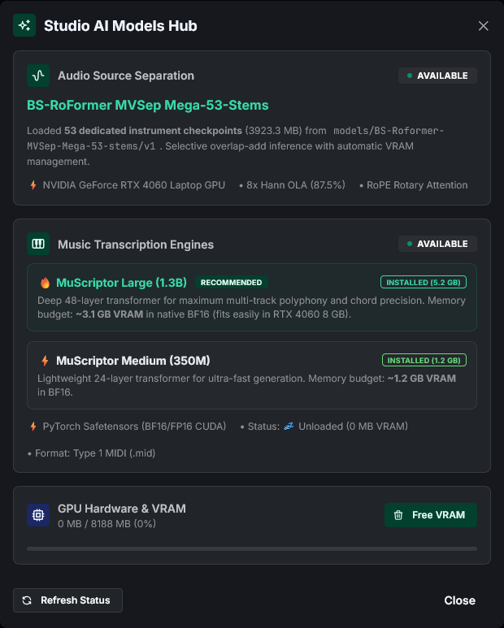

# 🧠 AI Models & Checkpoints Guide

SteMidi Studio incorporates state-of-the-art neural architectures optimized for multi-stem audio separation and polyphonic music transcription.

---

## 📑 Overview of Included Models

| Model | Purpose | Architecture | Parameters | VRAM Footprint | License |
| :--- | :--- | :--- | :--- | :--- | :--- |
| **BS-RoFormer Mega-53** | 53-Stem Audio Source Separation | Band-Split Rotary Transformer | ~40M per stem | ~2.5 GB peak | Public / Open |
| **MuScriptor Large** | Flagship Multi-Instrument AMT | 48-Layer Transformer | **1.3 Billion** | ~3.1 GB (BF16) | CC BY-NC 4.0 |
| **MuScriptor Medium** | Lightweight & Ultra-Fast AMT | 24-Layer Transformer | **350 Million** | ~1.2 GB (BF16) | CC BY-NC 4.0 |

<br/>

<div align="center">

</div>

---

## 1. 🎸 BS-RoFormer MVSep Mega-53-stems

Created by **noblebarkrr** and **ZFTurbo**, BS-RoFormer is widely recognized as one of the highest-performing audio source separation architectures in community benchmarks (SDR metrics exceeding 12+ dB across multiple instrument classes).

### Technical Highlights
- **Band-Split Rotary Architecture**: Unlike standard spectrogram UNets, BS-RoFormer divides the frequency spectrum into perceptually spaced sub-bands, processes each band using multi-head self-attention with Rotary Position Embeddings (RoPE), and reconstructs the complex audio waveform.
- **Hann 8x Overlap-Add (87.5% COLA)**: Audio is processed in chunks with an 8x overlap-add window. This eliminates edge phase mismatches, spectral smearing, and boundary artifacts.
- **Audio Fidelity**: Checkpoints operate natively on **44.1 kHz stereo audio** with standard 2048 FFT window and 512 hop length.

### Complete 53-Stem Instrument Catalog

The Mega-53 suite provides dedicated checkpoints for 53 distinct musical instruments across 9 categories:

| Category | Available Stems |
| :--- | :--- |
| **Vocals (5)** | `lead-vocal`, `backing-vocal`, `vocal-choir`, `spoken-voice`, `vocal` |
| **Pianos & Keys (5)** | `piano`, `electric-piano`, `organ`, `accordion`, `celesta` |
| **Guitars & Plucked (8)** | `acoustic-guitar`, `electric-guitar`, `nylon-guitar`, `12-string-guitar`, `banjo`, `mandolin`, `ukulele`, `harp` |
| **Bass (3)** | `electric-bass`, `acoustic-bass`, `synth-bass` |
| **Drums & Percussion (17)**| `drums`, `kick`, `snare`, `cymbals`, `toms`, `hi-hat`, `percussion`, `bongos`, `congas`, `tambourine`, `shaker`, `triangle`, `timpani`, `marimba`, `xylophone`, `vibraphone`, `glockenspiel` |
| **Strings (6)** | `violin`, `viola`, `cello`, `double-bass`, `strings-ensemble`, `pizzicato` |
| **Brass (5)** | `trumpet`, `trombone`, `french-horn`, `tuba`, `brass-section` |
| **Woodwinds (7)** | `flute`, `clarinet`, `oboe`, `bassoon`, `saxophone`, `harmonica`, `recorder` |
| **Synthesizers (3)** | `synth-lead`, `synth-pad`, `arpeggio` |

<br/>


---

## 2. 🎼 MuScriptor Polyphonic AMT Transformers

Created by **Mirelo** & **Kyutai**, MuScriptor represents the current state of the art in open-weights polyphonic Automatic Music Transcription (AMT).

### Technical Architecture
- **Autoregressive Sequence-to-Sequence**: Converts normalized continuous audio spectrogram representations directly into discrete musical token streams containing exact pitch (MIDI note numbers 21–108), onset times, offset times, and velocity dynamics (1–127).
- **Rotary Embeddings & SwiGLU**: Incorporates rotary position embeddings and SwiGLU non-linearities for long-context temporal stability across full songs.
- **Native PyTorch BF16 / FP16 CUDA Execution**: Models run with Bfloat16 or Half precision on NVIDIA Tensor Cores, transcribing audio 20x to 50x faster than real-time.

### Comparison: Large (1.3B) vs. Medium (350M)

| Specification | MuScriptor Large | MuScriptor Medium |
| :--- | :--- | :--- |
| **Recommended For** | Highest accuracy, dense polyphony, orchestral scores | Ultra-fast drafting, laptops, lower VRAM |
| **Parameter Count** | **1,335,000,000 (1.3B)** | **354,000,000 (350M)** |
| **Transformer Layers** | **48 Layers** | **24 Layers** |
| **Hidden Dimension ($d$)**| **1536** | **1024** |
| **Attention Heads** | **24 Heads** | **16 Heads** |
| **Checkpoint Size** | ~5.4 GB (`model.safetensors`) | ~1.2 GB (`model.safetensors`) |
| **VRAM Consumption** | ~3.1 GB | ~1.2 GB |
| **Speed (3-min audio)** | ~2–4 seconds (RTX 4060) | ~1 second (RTX 4060) |

### Instrument Conditioning Filters (35+ Instruments)

MuScriptor supports instrument conditioning. By selecting one or more target instrument tokens in the settings, the model constrains its self-attention to transcribe only the specified instruments, filtering out ambient audio or overlapping stems.

Available conditioning filters include:
- `piano`, `electric_piano`, `organ`, `synthesizer`
- `acoustic_guitar`, `electric_guitar_clean`, `electric_guitar_distortion`, `bass`
- `violin`, `viola`, `cello`, `double_bass`, `string_ensemble`
- `trumpet`, `trombone`, `french_horn`, `tuba`, `brass_section`
- `flute`, `clarinet`, `oboe`, `bassoon`, `saxophone`
- `drums`, `percussion`, `harp`, `choir`, `lead_vocals`

<br/>

<div align="center">

</div>

---

## 3. 🔑 Hugging Face Authentication (MuScriptor License)

MuScriptor model checkpoints are released under the **Creative Commons Attribution-NonCommercial 4.0 (CC BY-NC 4.0)** license. To access and download the weights:

### Step 1: Accept the License in Your Browser
1. Log into your [Hugging Face](https://huggingface.co) account.
2. Visit the model pages:
   - [MuScriptor Large (1.3B)](https://huggingface.co/MuScriptor/muscriptor-large)
   - [MuScriptor Medium (350M)](https://huggingface.co/MuScriptor/muscriptor-medium)
3. Click the **"Agree and access repository"** button. Access is granted instantly.

### Step 2: Create a Read Token
1. Go to [Hugging Face Settings -> Access Tokens](https://huggingface.co/settings/tokens).
2. Create a new token with **Read** permissions.
3. Copy the token string (`hf_...`).

### Step 3: Provide the Token
Choose any one of the following methods:

- **Method A (Environment Variable - Recommended)**:
  ```bash
  export HF_TOKEN="hf_..."        # On Windows: $env:HF_TOKEN="hf_..."
  ```
- **Method B (Hugging Face CLI)**:
  ```bash
  huggingface-cli login
  ```
- **Method C (Command-Line Argument)**:
  ```bash
  python scripts/download_models.py --muscriptor-large --hf-token "hf_..."
  ```

---

## 4. 📥 Model Downloading Guide

### Method 1: Automated Helper Script (`scripts/download_models.py`)

The included download script automatically detects your token, provides download progress bars, and places weights in their exact target paths.

```bash
# Interactive Mode (shows terminal menu):
python scripts/download_models.py

# Download MuScriptor Large (Recommended, ~5.4 GB):
python scripts/download_models.py --muscriptor-large

# Download MuScriptor Medium (~1.2 GB):
python scripts/download_models.py --muscriptor-medium

# Download All 53 BS-RoFormer Stems (~4.1 GB, no token needed):
python scripts/download_models.py --mega-53

# Download Selected Essential Stems Only (saves disk space):
python scripts/download_models.py --mega-stems lead-vocal drums bass electric-guitar piano acoustic-guitar

# Download Everything at once (~10.7 GB):
python scripts/download_models.py --all
```

---

### Method 2: Official Hugging Face CLI

If you prefer using `huggingface-cli`:

```bash
# 1. MuScriptor Large (1.3B)
huggingface-cli download MuScriptor/muscriptor-large model.safetensors \
  --local-dir models/muscriptor-large --local-dir-use-symlinks False

# 2. MuScriptor Medium (350M)
huggingface-cli download MuScriptor/muscriptor-medium model.safetensors \
  --local-dir models/muscriptor-medium --local-dir-use-symlinks False

# 3. BS-RoFormer Mega-53 Checkpoints
huggingface-cli download noblebarkrr/BS-Roformer-MVSep-Mega-53-stems \
  --local-dir models/BS-Roformer-MVSep-Mega-53-stems --local-dir-use-symlinks False
```

---

### Method 3: Manual Direct Download

Download weights using your browser and place them in the following paths:

```
models/
├── muscriptor-large/
│   ├── config.json               # (included in repository)
│   └── model.safetensors         # https://huggingface.co/MuScriptor/muscriptor-large/blob/main/model.safetensors
├── muscriptor-medium/
│   ├── config.json               # (included in repository)
│   └── model.safetensors         # https://huggingface.co/MuScriptor/muscriptor-medium/blob/main/model.safetensors
└── BS-Roformer-MVSep-Mega-53-stems/
    └── v1/
        ├── bs_mega_53stem_lead-vocal_mvsep.ckpt
        ├── bs_mega_53stem_lead-vocal_mvsep_config.yaml
        ├── bs_mega_53stem_drums_mvsep.ckpt
        ├── bs_mega_53stem_drums_mvsep_config.yaml
        └── ... (download desired stems from: https://huggingface.co/noblebarkrr/BS-Roformer-MVSep-Mega-53-stems/tree/main/v1)
```

---

## 5. 🧹 VRAM Footprint & Memory Management

SteMidi Studio manages GPU memory dynamically:

- **Checkpoints Auto-Unload**: Separation stem checkpoints are unloaded when idle.
- **Manual VRAM Purge**:
  - Click the **"Purge VRAM"** button in the Model Hub Modal or top navigation.
  - Or trigger via API: `POST /api/purge-vram`.
  - Clears PyTorch CUDA cached memory allocations via `torch.cuda.empty_cache()` and invokes Python garbage collection.
