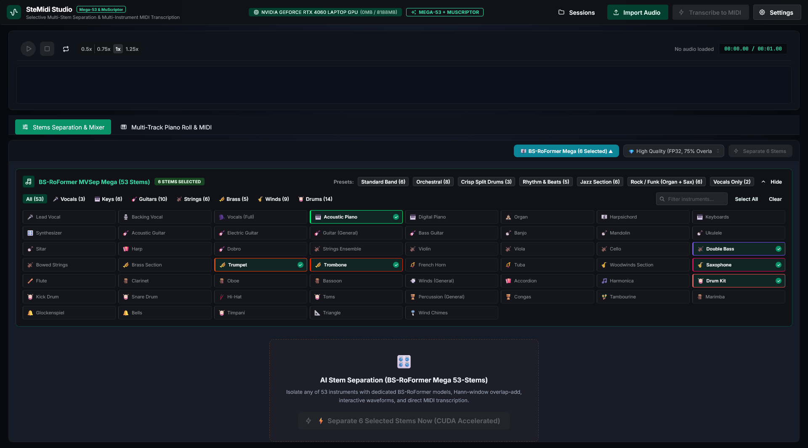
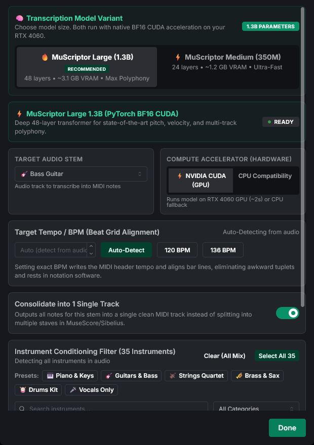

# 🎹 Studio User Guide & Workflow Walkthrough

This guide walks you through the complete end-to-end workflow of **SteMidi Studio**, from importing raw audio to separating multi-track stems, transcribing complex polyphonic MIDI, and exporting into your Digital Audio Workstation (DAW).

---

## 🖥️ Studio Interface Overview

---

## ⚡ Step-by-Step Workflow

### Step 1: Importing Audio
1. Click the **"Import Audio"** button in the top navigation bar, or drag and drop any audio file into the workspace.
2. **Supported Formats**:
   - Lossless: `.wav`, `.flac`, `.aiff`
   - Compressed: `.mp3`, `.m4a`, `.aac`, `.ogg`, `.opus`
3. SteMidi Studio automatically resamples the audio to 44.1 kHz stereo, creates a persistent session directory, and generates interactive waveform peak data.

---

### Step 2: Interactive Waveform & Transport Controls

The bottom transport panel provides full DAW-grade audio navigation and visual inspection:

- **Play / Pause**: Press <kbd>Spacebar</kbd> or click the teal play/pause button.
- **Stop & Return**: Click the Stop button (`■`) to halt playback and return to the beginning (or return to the loop region start if active).
- **Scrubbing / Seeking**: Click anywhere along the waveform to jump directly to that position. Hovering over the waveform shows an instant timestamp cursor.
- **Playback Speed**: Toggle between `0.5x`, `0.75x`, `1x`, and `1.25x` speeds for precise transcription auditing and slowed-down practicing.

#### Interactive Waveform Zooming
Inspect fine audio transients, rhythmic attacks, and vocal micro-phrasing:
- **Laptop Touchpads**:
  - Use two-finger pinch-in / pinch-out gestures over the waveform.
  - Or use the dedicated **Zoom Slider** (`Fit` to `300 px/s`) and the **`[-]` / `[+]`** zoom buttons on the transport toolbar.
  - Click the **Fit / Reset Zoom** button to instantly restore the full-track 100% overview.
  - When zoomed in, swipe horizontally with two fingers on your touchpad to smoothly pan across the audio.
- **Desktop Mouse**:
  - Scroll the mouse wheel vertically over the waveform to zoom in and out smoothly.
  - Drag the horizontal scrollbar or use the zoom buttons/slider.

#### Draggable Loop Regions & Playback Looping
Isolate specific musical phrases, choruses, or solo sections on repeat:
- **3 Flexible Ways to Set a Loop Region**:
  1. **Click & Drag**: Click anywhere on the waveform and drag horizontally to select the exact section.
  2. **`[In` / `Out]` Buttons**: Click the **`[In`** button on the transport toolbar (or press <kbd>[</kbd>) to set loop start at the current playhead; click **`Out]`** (or press <kbd>]</kbd>) to set loop end.
  3. **<kbd>Shift</kbd> + Click**: Click any position to place the playhead, then hold <kbd>Shift</kbd> and click anywhere else on the waveform to instantly span a loop between both points.
- **Adjust Boundaries**: Drag the glowing left or right edge handles (`←` / `→`) of the shaded region to expand or trim the loop range.
- **Move the Region**: Drag from the center of the region to shift the entire looped section forward or backward in time.
- **Loop Badge Navigation**: While active, the transport bar displays a loop badge (e.g. `🔁 00:14.20 – 00:26.80`). Click the badge at any time to instantly jump to the start of the loop.
- **Clear a Loop Region**:
  - Double-click the shaded region directly on the waveform, or
  - Click the `✕` icon on the transport bar's loop badge.
- **Full-Track Looping**: When no region is selected, toggling the Loop button (`🔁`) loops the entire audio mix or stem continuously from start to end.

---

### Step 3: Separating Stems with BS-RoFormer Mega-53
1. Navigate to the **Stems Mixer** tab.
2. Click **"Select Stems to Separate"** to open the **Mega-53 Instrument Selector**.

3. **Choose Target Stems**:
   - Use quick presets:
     - **Vocal & Backing**: `lead-vocal`, `backing-vocal`
     - **Rhythm Section**: `drums`, `electric-bass`, `percussion`
     - **Keys & Guitar**: `piano`, `acoustic-guitar`, `electric-guitar`
     - **Strings & Brass**: `violin`, `cello`, `trumpet`, `saxophone`
   - Or search and check any individual stem among the **53 available instruments**.
4. Select separation quality (Standard vs. High Quality 8x OLA).
5. Click **"Start Separation"**. Real-time progress is streamed via WebSocket with a progress bar and status indicator.

---

### Step 4: Multi-Track Stem Mixer
Once separation finishes, each isolated instrument stem appears as an independent channel strip in the **Stems Mixer**:

- **Volume Faders**: Adjust individual track levels from $-\infty$ to $+6\text{ dB}$.
- **Mute (<kbd>M</kbd>)**: Silence a track without removing it from the session.
- **Solo (<kbd>S</kbd>)**: Isolate one or more tracks to focus your listening.
- **Source Mode (Mix vs. Stems)**:
  - Toggle between **Original Audio Mix** and **Separated Stems** to compare separation fidelity.

---

### Step 5: Multi-Instrument Polyphonic MIDI Transcription
1. Click the **"Transcribe to MIDI"** button in the top header, or open the **Settings** menu.

2. Configure transcription options:
   - **Model Variant**:
     - **MuScriptor Large (1.3B)** *(Recommended)*: Maximum polyphonic accuracy, complex chord detection, and expressive velocity resolution.
     - **MuScriptor Medium (350M)**: Ultra-fast transcription, lower VRAM footprint.
   - **Target Audio Stem**: Choose whether to transcribe the **Full Audio Mix** or an **Isolated Stem** (e.g. transcribe only the separated `piano` or `acoustic-guitar` stem for pristine clarity).
   - **Instrument Conditioning Filter**:
     - Constrain transcription to specific instruments (e.g. `piano`, `electric_guitar_clean`, `violin`) to prevent bleed and eliminate phantom notes from other instruments.
   - **Target Tempo / BPM (Beat Grid Alignment)**:
     - **Auto-Detect**: Detects song tempo automatically.
     - **Manual BPM**: Explicitly sets the tempo header (e.g. `120 BPM`), aligning bar lines and eliminating irrational tuplets or micro-rests in sheet music notation software.
   - **Consolidate into 1 Single Track**:
     - Enable to export all notes into a single unified MIDI track (ideal for notation editors like MuseScore / Sibelius).
     - Disable to split distinct instrument parts across individual MIDI tracks.
3. Click **"Transcribe"**. Transcription typically completes in 2 to 4 seconds on an RTX 4060.

---

### Step 6: Interactive Piano Roll Editor & Real-Time Auditioning
Switch to the **Piano Roll** tab to inspect and edit transcribed MIDI notes:

#### 1. Visualizing Notes
- Notes are displayed across a vertical piano keyboard grid (pitch C1 to C8) against musical time (seconds or bars).
- Notes are color-coded by velocity (soft blue to bright vibrant green/orange).

#### 2. Editing Notes
- **Select**: Click a note to select it; hold <kbd>Shift</kbd> to select multiple notes.
- **Move / Transpose**: Drag notes horizontally to adjust start time, or vertically to transpose pitch.
- **Resize Duration**: Drag the right edge of any note to lengthen or shorten its duration.
- **Delete**: Select note(s) and press <kbd>Delete</kbd> or <kbd>Backspace</kbd>.

#### 3. Real-Time Web Audio Synthesizer Auditioning
- Click **Play** to hear the transcribed MIDI notes synthesized in real time via the built-in Web Audio engine.
- Notes sound with an acoustic piano timbre, featuring a sharp 4 ms attack and dynamics compression.

#### 4. Tuning Audio-to-MIDI Latency Sync (`Sync: -60ms`)
Because operating system audio drivers introduce small buffer delays (40–80 ms) between the media player and the synthesizer, the Piano Roll toolbar includes a **`Sync`** micro-control:
- **Default**: `-60 ms` (calibrated for standard desktop audio interfaces).
- **Adjustment**: Click `[-]` or `[+]` in 10 ms increments while listening to the audio mix until the acoustic transients and synthesized notes fire in phase unison.

---

### Step 7: Exporting Results into Your DAW

Click the **"Export"** dropdown button in the top navigation bar:

1. **Export MIDI (`.mid`)**:
   - Downloads a standard **Type 1 Multi-Track MIDI** file.
   - Fully compatible with **Ableton Live**, **FL Studio**, **Logic Pro**, **Reaper**, **Cubase**, **Studio One**, **Sibelius**, and **MuseScore**.
   - Preserves exact note velocities, tempo headers (BPM), and track channel names.
2. **Export Stems Archive (`.zip`)**:
   - Downloads all separated 44.1 kHz stereo WAV stems in a compressed archive.
3. **Export Complete Project (`.zip`)**:
   - Exports the original audio, all separated stem WAVs, MIDI file, and session metadata.

---

### Step 8: Project Sessions & History
- Click the **"Sessions"** button in the header to view past project sessions.
- Search sessions by audio filename, session ID, or isolated stem names.
- Click **"Reopen"** to restore an earlier session, or **"Delete"** to remove temporary files and free disk space.
